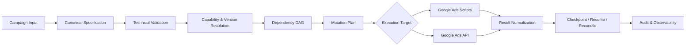

# AdsForge

### Google Ads Campaign Compiler & Execution Engine

[](docs/public-roadmap.md)
[](SECURITY.md)
[](https://developers.google.com/google-ads/api)
[](https://developers.google.com/google-ads/scripts)

**AdsForge is a compiler-style automation architecture for turning normalized Google Ads campaign intent into validated, deterministic, recoverable execution workflows.**

The project is built around one idea:

> **Define the campaign once. Compile the execution workflow deterministically.**

Instead of coupling campaign creation directly to UI actions or one API version, AdsForge separates campaign intent, validation, dependency planning, execution adapters, result parsing, and recovery into explicit stages.

---

## The problem

Google Ads automation becomes difficult when campaign launches need to be:

- repeatable across accounts;
- safe to retry;
- aware of resource dependencies;
- resilient to partial or uncertain execution outcomes;
- isolated by API version;
- observable and recoverable;
- usable through both Google Ads Scripts and backend API execution.

A simple script can create resources. A production launch engine also needs to know **what should be created, in what order, under which capabilities, with which retry rules, and how to resume safely after failure**.

AdsForge treats that as a compilation problem.

---

## Compiler pipeline



### Core contract

```text
Campaign Input
→ Canonical Specification
→ Validation
→ Capability Resolution
→ Dependency Graph
→ Mutation Plan
→ Dry Run / Validate / Execute
→ Result Parsing
→ Checkpoint / Resume / Reconcile
```

---

## Engineering goals

### Deterministic compilation

For the same normalized specification and adapter version, AdsForge should produce the same ordered mutation plan.

### Dependency-aware execution

Resources are compiled according to explicit dependencies rather than arbitrary request order.

Typical examples:

```text
Campaign Budget → Campaign → Ad Group → Criterion / Ad
```

```text
Assets → Asset Group → Asset Group Asset Links
```

### Idempotent launch behavior

Repeated launch requests should not create unintended duplicates. Execution state, specification identity, and reconciliation are treated as first-class concerns.

### Validation-first runtime

The architecture favors dry-run and validation workflows before live execution, with conservative launch defaults.

### Resume and reconciliation

If execution is interrupted or the result is uncertain, the runtime should preserve known resource identifiers and reconcile account state before retrying.

### Version isolation

Google Ads-specific serialization, enum mapping, and field behavior belong behind versioned adapters rather than inside the compiler core.

### Structured errors

External Google Ads errors should be normalized back to the affected operation and originating specification path so failures remain actionable.

---

## Execution targets

| Target | Role | Public status |
|---|---|---|
| **Google Ads Scripts** | Generate script-compatible mutation workflows using supported `AdsApp` mutation primitives | Architecture defined; implementation remains under active development |
| **Google Ads API** | Backend execution through versioned Google Ads API adapters | Architecture defined; implementation remains under active development |

The compiler core is intentionally designed to remain execution-target independent.

---

## Campaign architecture

The current public design covers three campaign families:

| Campaign family | Public architecture status | Primary resource model |
|---|---|---|
| **Search** | Defined | Budget → Campaign → Ad Group → Keywords / Responsive Search Ads |
| **Performance Max** | Defined | Budget → Campaign → Assets → Asset Group → Asset links / Signals |
| **Demand Gen** | Defined | Budget → Campaign → Assets → Ad Group → Audience / Ads |

This table describes the **public architecture and dependency model**, not a claim that every production mutation path is already released in this repository.

---

## Example: from intent to execution plan

A simplified sanitized workflow looks like this:

```text
Input
  campaign type: SEARCH
  execution mode: DRY_RUN
  target: BACKEND_GOOGLE_ADS_API

Compiler
  normalize specification
  validate required fields
  resolve capabilities
  build dependency graph
  allocate operation order

Plan
  1. CampaignBudget
  2. Campaign
  3. CampaignCriterion
  4. AdGroup
  5. AdGroupCriterion
  6. AdGroupAd

Runtime
  dry run → no account mutation
```

See [docs/example-workflow.md](docs/example-workflow.md) for a fuller sanitized example.

---

## Architecture layers

```text
┌──────────────────────────────────────────────┐
│ Campaign Inputs / Templates / Bulk Sources  │
├──────────────────────────────────────────────┤
│ Canonical Campaign Specification            │
├──────────────────────────────────────────────┤
│ Schema + Capability + Version Validation    │
├──────────────────────────────────────────────┤
│ Dependency DAG + Mutation Compiler          │
├──────────────────────────────────────────────┤
│ Idempotency + Checkpoints + Reconciliation  │
├───────────────────────┬──────────────────────┤
│ Google Ads Scripts    │ Google Ads API       │
│ Execution Adapter     │ Execution Adapter    │
├───────────────────────┴──────────────────────┤
│ Result Parsing + Audit + Observability       │
└──────────────────────────────────────────────┘
```

More detail: [Architecture Overview](docs/architecture-overview.md).

---

## Public repository scope

This repository is intentionally a **sanitized engineering showcase**.

It publishes enough to explain the compiler model, technical decisions, and project direction without exposing production implementation details or customer data.

### Public here

- architecture overview;
- execution model;
- dependency concepts;
- engineering principles;
- sanitized examples;
- public roadmap.

### Kept private

- production credentials and OAuth secrets;
- customer and manager account identifiers;
- production campaign specifications;
- complete internal schemas and registries;
- proprietary production serializers and adapters;
- tenant authorization implementation;
- production checkpoints and execution logs;
- private tracker configuration;
- commercial and operational playbooks.

See [SECURITY.md](SECURITY.md).

---

## Technology direction

- **Node.js / JavaScript / TypeScript**
- **Google Ads API**
- **Google Ads Scripts**
- **REST / mutation workflows**
- **JSON Schema validation**
- **OAuth 2.0**
- **Idempotency and reconciliation**
- **Structured error handling**
- **Checkpoint persistence**
- **Multi-tenant SaaS architecture**

---

## Project status

**Active development.**

The public repository currently documents the architecture and sanitized engineering model. Production implementation remains private while the compiler core, execution runtime, adapters, and SaaS infrastructure evolve.

See the [Public Roadmap](docs/public-roadmap.md).

---

## Documentation

- [Architecture Overview](docs/architecture-overview.md)
- [Sanitized Example Workflow](docs/example-workflow.md)
- [Public Roadmap](docs/public-roadmap.md)
- [Security & Disclosure Policy](SECURITY.md)

---

## What AdsForge is not

AdsForge is not a browser macro, UI click recorder, or a single-purpose campaign creation script.

The architectural goal is a reusable campaign compiler and execution layer where validation, dependencies, idempotency, versioning, recovery, and observability are explicit parts of the system.

---

## License

No license is granted unless a license file is explicitly added to this repository.
