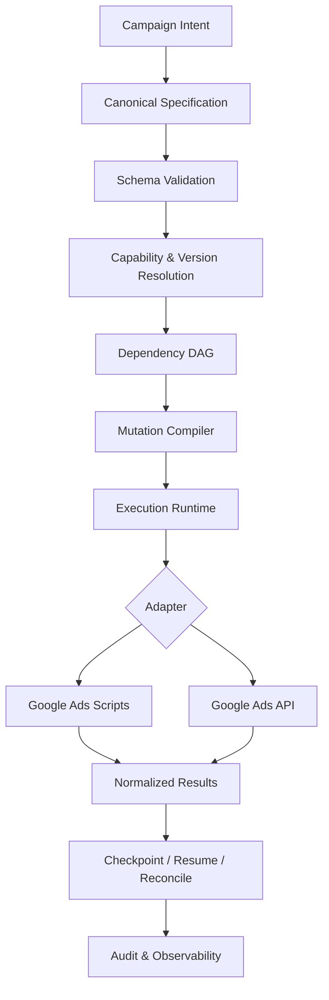
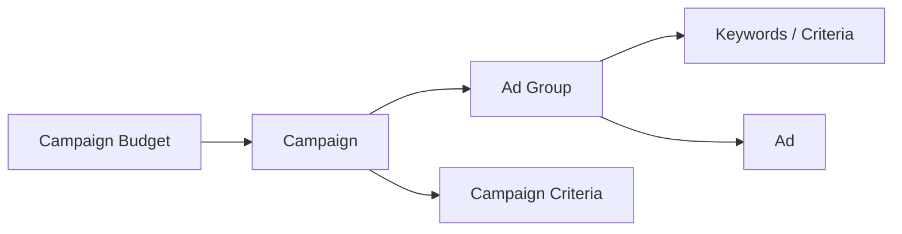
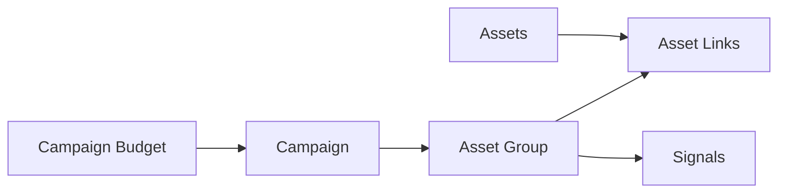
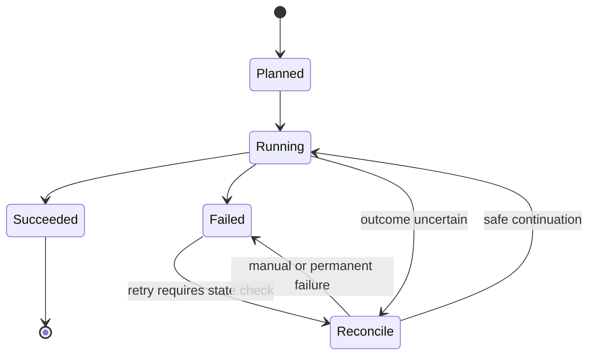

# AdsForge Architecture Overview

AdsForge treats Google Ads campaign deployment as a **compilation and execution problem**, not as a sequence of UI automation steps.

The core design separates campaign intent from Google Ads-specific mutation serialization so the same normalized specification can be validated, planned, and executed through different supported targets.

## System view



## Architectural invariants

The public design is organized around several invariants:

1. **Raw input is never compiled directly into mutation JSON.**
2. **Capability checks happen before live execution.**
3. **Resource dependencies determine mutation order.**
4. **Execution targets do not own the canonical campaign model.**
5. **Retries must preserve idempotency.**
6. **Uncertain outcomes are reconciled before blind retry.**
7. **Version-specific fields and enums remain behind adapters.**
8. **Production credentials and tenant data remain outside generated public artifacts.**

---

## 1. Canonical specification

The canonical specification is the transport-independent contract between campaign intent and execution.

It is designed to normalize concerns such as:

- account context;
- execution mode;
- campaign type;
- budget and bidding;
- targeting;
- assets and ads;
- tracking;
- conversion configuration;
- metadata required for deterministic execution.

The complete production schema is intentionally not published in this repository.

---

## 2. Validation layers

Validation is separated into layers rather than implemented as one large request-time check.

```text
Canonical Structure
        ↓
Technical Field Validation
        ↓
Capability Resolution
        ↓
Version Compatibility
        ↓
Account / Execution Preconditions
        ↓
Dependency Validation
```

This allows failures to be returned before mutation planning when an execution path is unavailable or structurally invalid.

---

## 3. Capability and version resolution

Google Ads capabilities vary by campaign family, resource, execution target, and API version.

AdsForge therefore treats capability resolution as explicit compiler input.

Representative capability states include:

- `SUPPORTED`
- `PARTIALLY_SUPPORTED`
- `REQUIRES_PREREQUISITE`
- `READ_ONLY`
- `UNSUPPORTED`
- `DEPRECATED`
- `UNKNOWN`

Unknown or unverified live execution paths should fail closed rather than silently dropping fields or changing versions.

---

## 4. Dependency graph

Campaign resources form a directed dependency graph.

### Search-style example



### Asset-group-style example



The graph is responsible for defining:

- ordering;
- dependency edges;
- atomic boundaries;
- operation-to-source mapping;
- checkpoint stages;
- retry classification.

The production graph definitions and temporary-ID allocation strategy remain private.

---

## 5. Mutation compiler

The mutation compiler converts validated graph nodes into target-neutral operation intent before an execution adapter serializes it.

Conceptually:

```text
Canonical Specification
        ↓
Validated Graph Nodes
        ↓
Ordered Operation Intent
        ↓
Versioned Serialization
        ↓
Execution Request
```

This keeps campaign-type planning separate from transport-specific JSON or script objects.

---

## 6. Execution runtime

The runtime coordinates how a compiled plan is used.

Public execution modes are conceptually grouped as:

```text
DRY RUN
  compile and inspect, no mutation

VALIDATE
  perform supported validation without intended launch

EXECUTE
  submit an approved mutation plan

RESUME
  continue from persisted execution state
```

The runtime is also responsible for bounded batching, result inspection, checkpoint persistence, and retry classification.

---

## 7. Execution adapters

### Google Ads Scripts

The Scripts adapter targets supported Google Ads Scripts mutation primitives and the Scripts execution environment.

It must account for runtime limits, bounded batching, result inspection, and the fact that generated scripts must not contain backend OAuth credentials or developer tokens.

### Google Ads API

The backend adapter targets versioned Google Ads API mutation requests.

Authentication, account authorization, version-specific serialization, and normalized error handling remain backend concerns rather than compiler-core responsibilities.

---

## 8. Idempotency and reconciliation

A production launch engine cannot assume that every retry begins from a clean state.

AdsForge therefore treats launch identity and reconciliation as architectural primitives.



The private implementation determines exact persistence, conflict resolution, and retry mechanics.

---

## 9. Error normalization

Errors from an external execution target are mapped back to internal operation context.

A normalized failure should preserve enough information to answer:

- which operation failed;
- which source field produced it;
- which external request it belongs to;
- whether a retry is safe;
- what technical correction is suggested.

The internal production error catalog is not published here.

---

## 10. Tenant isolation

The production SaaS architecture isolates account access, credentials, specifications, launch state, logs, checkpoints, and results by tenant.

The public repository intentionally omits:

- credential storage implementation;
- account-authorization middleware;
- production tenant identifiers;
- signing and replay-protection details;
- infrastructure topology;
- production logs and checkpoints.

See [../SECURITY.md](../SECURITY.md).

---

## Public architecture status

This document describes the **defined public architecture** of AdsForge. It should not be interpreted as a claim that every adapter and campaign mutation path shown here is already production-released in this repository.

The production implementation remains private and under active development.
