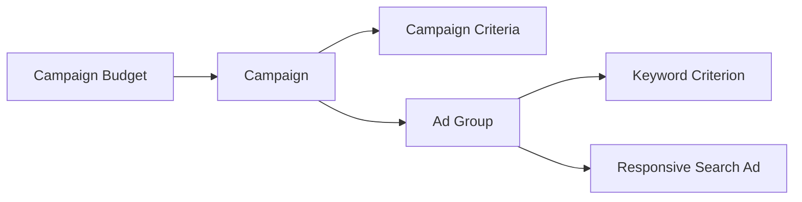

# Sanitized Compilation Workflow

This example demonstrates the AdsForge compiler model using synthetic data only.

It is intentionally simplified and does **not** expose the complete production schema, capability registry, serializer format, or execution implementation.

## 1. Campaign intent

A caller wants to prepare a paused Search campaign through the backend execution target.

```yaml
workspace: demo-workspace
account: synthetic-customer
campaignType: SEARCH
campaignName: Demo Search Campaign
executionTarget: BACKEND_GOOGLE_ADS_API
executionMode: DRY_RUN
budget:
  type: DAILY
  amount: synthetic-value
adGroups:
  - name: Demo Ad Group
    keywords:
      - example keyword
    ads:
      - type: RESPONSIVE_SEARCH_AD
        destination: https://example.com
```

The example omits production identifiers, tracking configuration, internal metadata, exact field contracts, and adapter-specific values.

---

## 2. Canonical normalization

AdsForge first converts external input into a stable internal representation.

Conceptually:

```text
External Input
     ↓
Canonical Campaign Specification
```

At this stage the compiler separates campaign intent from transport-specific mutation JSON.

---

## 3. Validation

The normalized specification passes through technical validation layers.

```text
Schema Validation
      ↓
Campaign Capability Check
      ↓
Execution Target Check
      ↓
Version Compatibility
      ↓
Dependency Validation
```

A failure here should stop the plan before account mutation.

---

## 4. Dependency planning

For this simplified Search example, AdsForge derives a resource graph similar to:



The graph establishes which resources must exist before dependent resources can reference them.

---

## 5. Ordered mutation plan

The compiler can now emit an ordered plan without yet executing it.

```text
Operation 1 → CampaignBudget
Operation 2 → Campaign
Operation 3 → CampaignCriterion
Operation 4 → AdGroup
Operation 5 → AdGroupCriterion
Operation 6 → AdGroupAd
```

Each production operation also needs internal context for dependency tracking, error mapping, idempotency, and checkpointing. Those implementation details are intentionally not published here.

---

## 6. Dry-run result

Because the requested mode is `DRY_RUN`, AdsForge stops before mutation.

A conceptual result could look like:

```yaml
status: PLAN_READY
executionPerformed: false
campaignType: SEARCH
executionTarget: BACKEND_GOOGLE_ADS_API
operationCount: 6
validationErrors: []
```

This gives the caller a deterministic execution plan that can be inspected before live execution.

---

## 7. Live execution path

When a validated plan is later approved for execution, the runtime would conceptually continue through:

```text
Compiled Plan
    ↓
Versioned Adapter
    ↓
Google Ads Mutation Request
    ↓
Result Inspection
    ↓
Normalized Results
    ↓
Checkpoint / Resume / Reconcile
```

If the execution outcome is uncertain, the architectural rule is to reconcile known account state before blindly retrying the launch.

---

## Why this matters

The important difference is that AdsForge does not treat campaign creation as a list of independent API calls.

The system models:

- campaign intent;
- validation;
- API capability;
- dependency order;
- execution mode;
- result identity;
- retry safety;
- recovery state.

That is the foundation for turning campaign launch automation into a reusable execution platform rather than a collection of one-off scripts.
